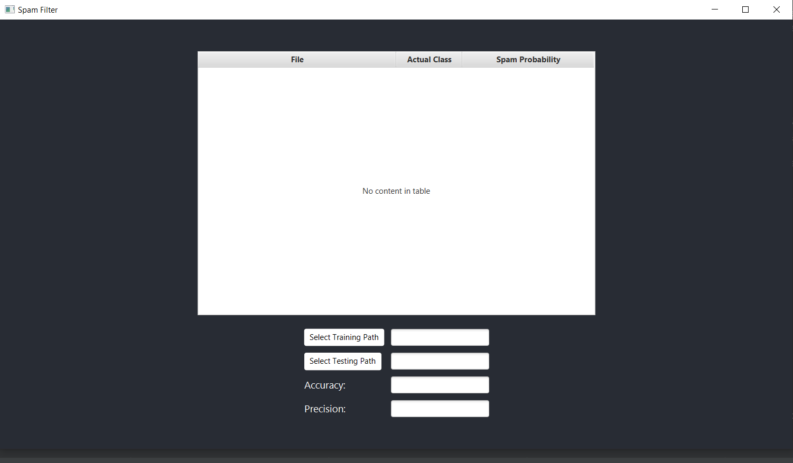
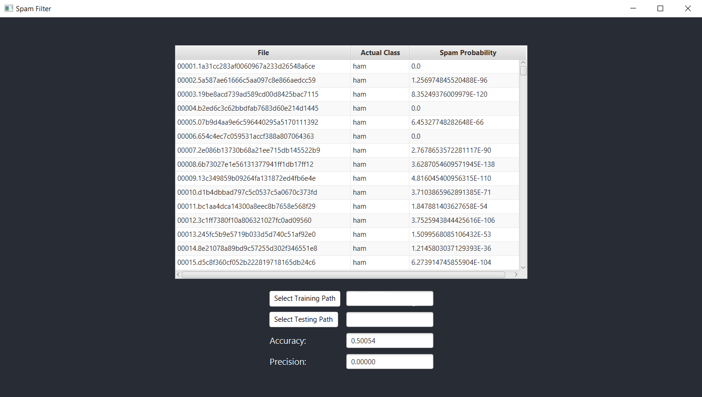

## Project Information:
This is a simple spam detector developed using java and the interface was managed using javaFX. The purpose
of this project was to understand File I/O and learn the MVC fundamentals using a provided dataset of emails
for the model. 

### Improvements:
The improvements made to this project were that of the interface, mainly the color and the overall
UX (user interface) was enhanced using css.

### Run this Project:
Prerequistes: You must have java 12, intellij IDE, and javafx installed on your computer.  
To run this project on your local machine git clone this repository by either using git command `git clone`, or
download the zip file and extract to a desired location on your machine. After this project is on your machine
run the main file and the user will be prompt to select a train Folder and test Folder. First select 
the train Folder to train the dataset, the folder which you will select will be `data/train`. After the data has 
been trained select the test folder button, and the folder which you will select will be `data/test`. The program will
then run, populating the table with the file, and the probability that the file is spam.    

TLDR: 
1. `git clone` or download zip
2. select run button (to run main) on top left of IDE (intellij)
3. select `select train folder` button and select folder `data/train`
4. select `select test folder` button and select folder `data/test`

**Note**: This project runs on Java 12, if you have a new version you can manually change the settings in the module settings
and set it to the Java version that you are using. 

This is an example output of the project:

This is an example of the project after training the data first and testing the trained dataset (the empty text fields 
select training/testing path buttons are filled with your absolute path to that location):

(Note: The current output is incorrect and displays incorrect output, the purpose of this assignment was
to train the dataset using the train folder and the use the test folder to achieve the accuracy and precision of
this the probability. Currently a function is not calculating properly the probability and thus giving false output.)
****

### Technologies Used:
The technologies used in this project were:
1. Java
2. JavaFX
3. FXML/CSS

## Resources Used:
Resources used for this project were:
1. [Looping Through Map](https://www.geeksforgeeks.org/how-to-iterate-over-a-treemap-in-java/)
2. [Parsing CSV](https://www.javatpoint.com/how-to-read-csv-file-in-java) (implemented in Branch `prototype` and later deprecated)
3. [Using Directory Chooser in Controller](https://stackoverflow.com/questions/25491732/how-do-i-open-the-javafx-filechooser-from-a-controller-class)
4. [JavaFx FXML CSS](https://www.callicoder.com/javafx-css-tutorial/)
5. WordCounter example from Professor Mariana S.
